# homespec

A house as source code.

One spec compiles into everything a project needs: the contractor's BIM
model, dimensioned drawings, schedules, a rule report, and a walkthrough you
can walk around in. Edit the spec, rebuild, and every output agrees.

```python
from homespec import *

def build() -> House:
    with House("cabin") as house:
        L0 = Level("L0", height=2700)
        g = Grid(x={"A": 0, "B": 6000}, y={"1": 0, "2": 4000})
        A, B, one, two = g.lines("A", "B", "1", "2")

        plaster = Material("plaster", texture="polyhaven/painted_plaster_wall", product="Lime plaster", supplier="TBD")
        timber = Material("timber", product="Timber framing", supplier="TBD")
        glass = Material("glass", product="Double glazing", supplier="TBD")
        ext = Assembly("ext", layers=[Layer(material="plaster", thickness=15), Layer(material="timber", thickness=140),
                                      Layer(material="plaster", thickness=15)], finish_in=plaster)

        W1 = Wall("W1", A & one, B & one, assembly=ext, level=L0)
        W2 = Wall("W2", B & one, B & two, assembly=ext, level=L0)
        W3 = Wall("W3", B & two, A & two, assembly=ext, level=L0)
        W4 = Wall("W4", A & two, A & one, assembly=ext, level=L0)
        Door("D1", host=W1, width=1000, height=2100, at=600, frame=timber, leaf=timber, glazing=glass)
        Window("N1", host=W3, width=2600, height=1500, sill=900, at="center", frame=timber, glazing=glass)
        Space("room", outline=[A & one, B & one, B & two, A & two], use="studio", level=L0, bounded_by=[W1, W2, W3, W4])
    return house
```

Save a spec as `project.py` beside its `decisions.md`. To build an existing
example after installing:

```bash
uv run --frozen homespec build projects/library_room
```

The command prints the immutable generation directory and its check status.
`out/library_room/manifest.json` identifies the latest attempt; geometry and
exports live together under `out/library_room/generations/<generation>/`.

## What you get

- **`house.ifc`** — IFC 4 with real `IfcWall` bodies, `IfcOpeningElement`
  voids filled by doors and windows, storeys, spaces, materials, and a
  property set on every element carrying its spec parameters. Opens in any
  BIM tool.
- **`drawings/`** — a dimensioned floor plan as SVG, PDF and DXF. A true
  section cut with the CAD kernel, with every opening dimensioned from its
  wall's start.
- **`schedules/`** — walls, openings, finishes, joinery, services, spaces as
  CSV.
- **`checks.md`** — every rule that ran and what it found: the rules of
  thumb, every pair of solids that share volume and whether construction
  allows it, and whether `decisions.md` still refers to things that exist.
  Plus an IDS file validated against the IFC.
- **Diagnostic views** — on request (`homespec views`), Workbench renders of the same
  model for the eye: orbits, elevations, a plan section per storey, a long
  and a cross section, the structure alone. One colour per kind, black
  outlines, a second per frame.
- **Blender scenes** — `house.blend` for stills and animation, and
  `house_walk.blend` for a first-person walk. Views, renders and scenes live
  under `out/<project>/presentation/<generation>/<presentation-fingerprint>/`.

Every entity keeps its id everywhere: spec, IFC name, drawing tag, schedule
row, Blender object.

## Install

```bash
uv sync --frozen --extra dev --python 3.13
uv run --frozen homespec assets   # optional CC0 textures and models for rendering
```

The tested Blender version is [5.2.1](https://www.blender.org); set
`HOMESPEC_BLENDER` if its executable is not discovered automatically. PDF output
needs `rsvg-convert` (`brew install librsvg`); SVG and DXF need nothing.

## Looking, rendering and walking

The commands below assume the virtual environment is active (`source
.venv/bin/activate`); alternatively prefix each command with `uv run --frozen`.

```bash
homespec build  projects/library_room
homespec build  projects/bastide_montfuron
homespec views  projects/library_room                   # diagnostic views for the published generation
homespec views  projects/bastide_montfuron --focus CH   # plus close-ups of one entity
homespec audit  projects/bastide_montfuron              # the dressed scene, judged: things in walls, floating, in the way
homespec render projects/library_room --mode still      # a Cycles frame
homespec render projects/library_room --mode anim       # frames for ffmpeg
homespec render projects/library_room --mode save       # the walk file
homespec walk   projects/library_room                   # open it; press W to walk
homespec render projects/library_room --device cpu      # explicit CPU rendering
```

Every consumer verifies source freshness and artifact hashes. Views and audits
can inspect complete builds with failed or skipped checks. Rendering and walking
require `passed`, unless `--allow-failed-checks` is explicit; that flag never
bypasses stale inputs or damaged files. Rebuild after editing source.

GPU selection defaults to `auto`, discovering available backends and falling back
to CPU. `--device` accepts `cpu`, `metal`, `cuda`, `optix`, `hip`, or `oneapi`; an
unavailable explicit choice fails. Saved scenes also carry a build/presentation
fingerprint and file hash, so an old scene cannot silently serve a new build.
The presentation fingerprint also covers the downloaded `assets/` tree; changing
a texture or fetching a missing model requires a fresh presentation.

The views need no presentation and no textures. Look there before spending
an hour on Cycles: a chimney floating above its ridge or a stair through a
ceiling is obvious in a section and invisible in a photograph. The audit
looks at what the presentation adds, the way a designer would: a console
inside a wall, candlesticks in the air, a bed across a doorway, a pot at
the foot of a stair. Every render prints the same findings first.

| | |
|---|---|
| 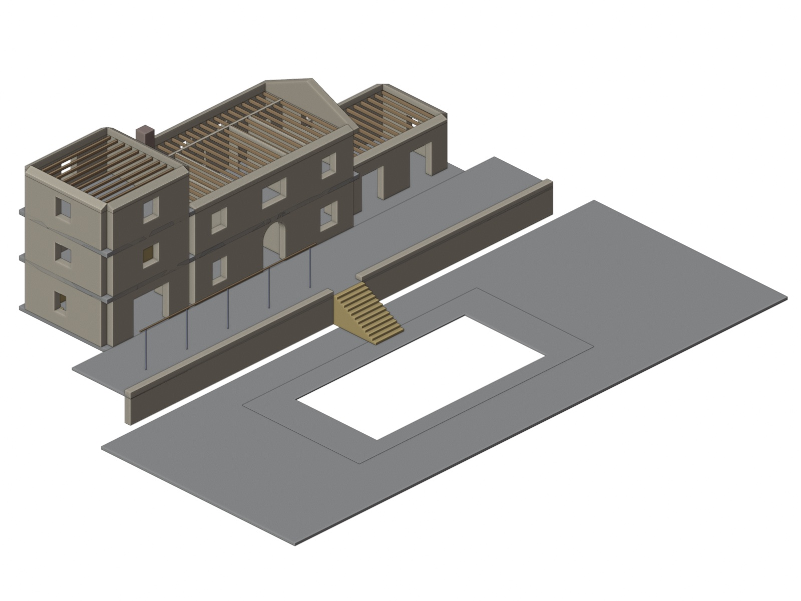 | 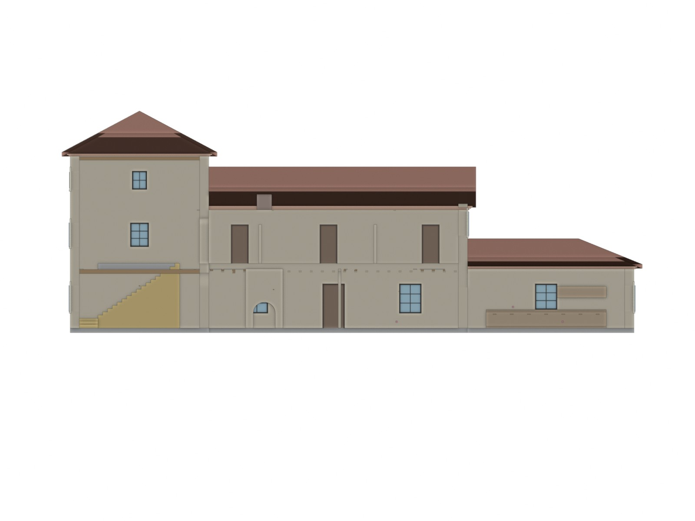 |

## How it is put together

```
source ──compile──▶ IR ──export──▶ IFC · drawings · schedules · checks · Blender
```

The **source** is a Python file in a declarative subset: definitions and
elements as constructor calls. The **IR** is the compiled house as data, with
exact geometry per entity, a JSON schema and a version. After realization and
all cuts, a separate analysis pass publishes room/opening links and stair
clearance facts. Checks and schedules share those facts. Every exporter reads
only the IR. The core does not know what a wall is; `Wall` is an ordinary
element class in the standard vocabulary, and a project can add its own.

Read [docs/design.md](docs/design.md) for the reasoning and
[docs/vocabulary.md](docs/vocabulary.md) for every element and its fields.
Three example projects live in `projects/`, each with its `decisions.md`:
`library_room`, one furnished room; `casale_poggio`, a two-bedroom Umbrian
stone farmhouse with a gable roof, arches, a pergola and a pool; and
`bastide_montfuron`, a three-storey Provençal villa.

## Example: Bastide de Montfuron

A tower, two wings, hipped and gabled roofs with génoise cornices, louvred
shutters in dressed-stone surrounds, an arched glazed door, a brande pergola,
two straight stairs, a terrace over a retaining wall and a pool garden two
metres below. The generated report lists every check and each pair of solids
that shares volume, with the construction reason when that overlap is allowed.

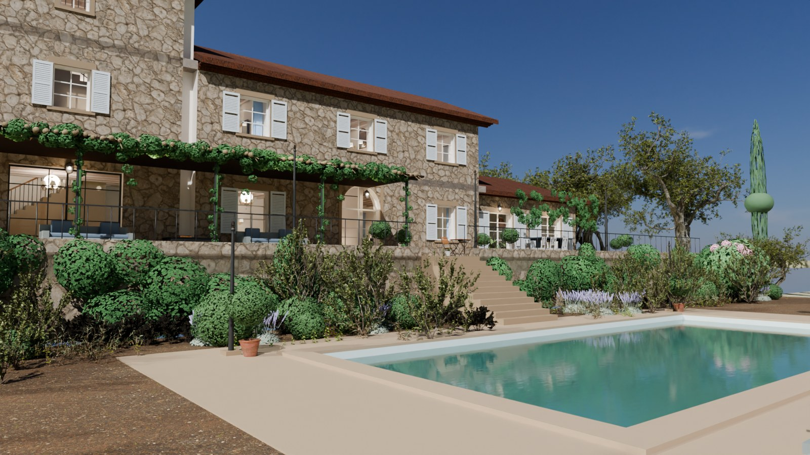

| | |
|---|---|
| 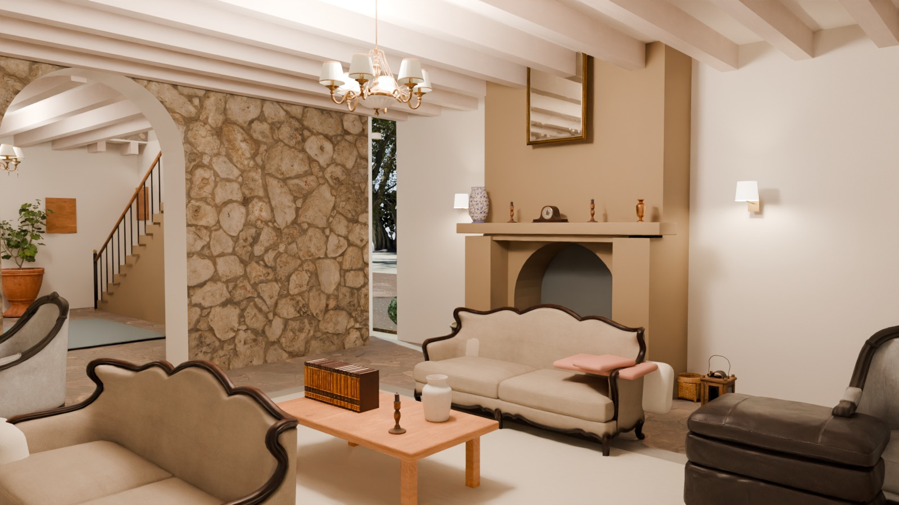 | 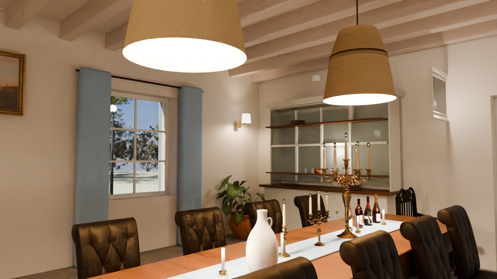 |
| 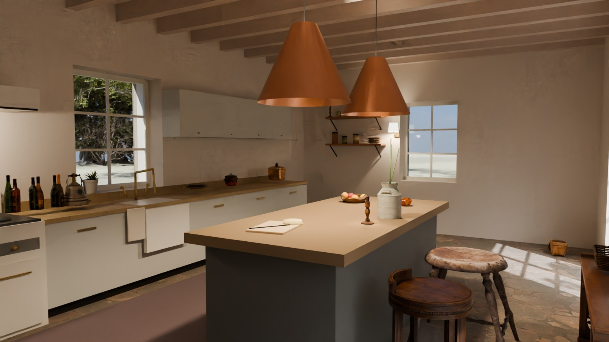 | 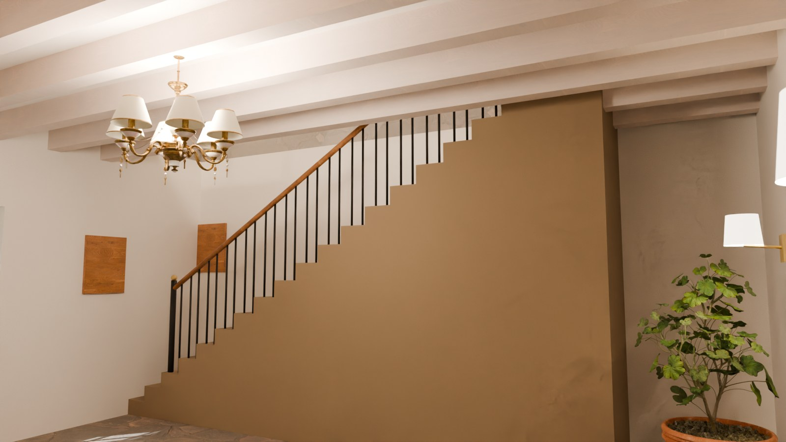 |
| 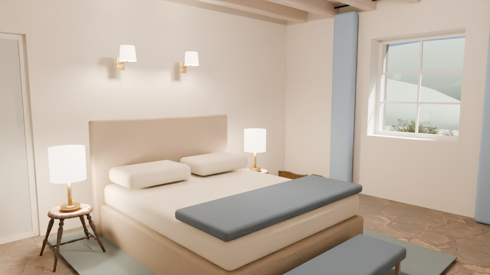 | 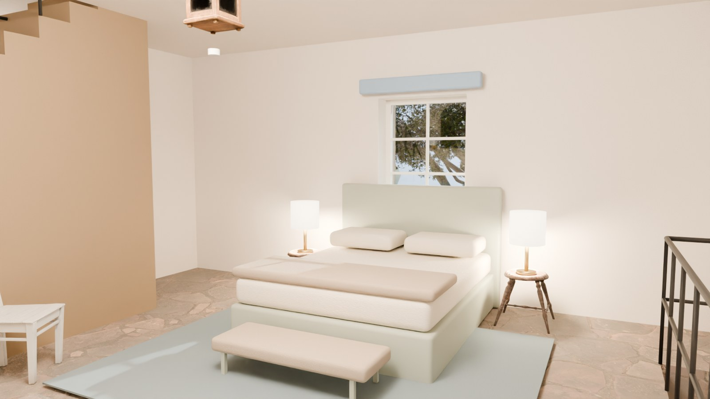 |
| 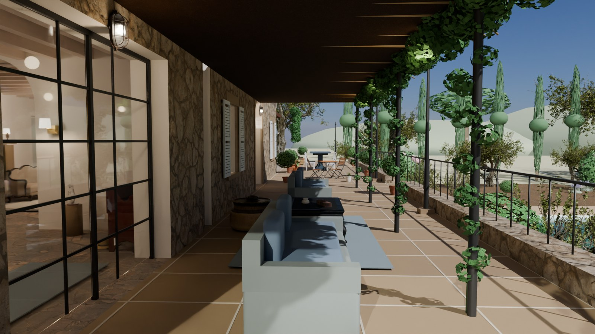 | 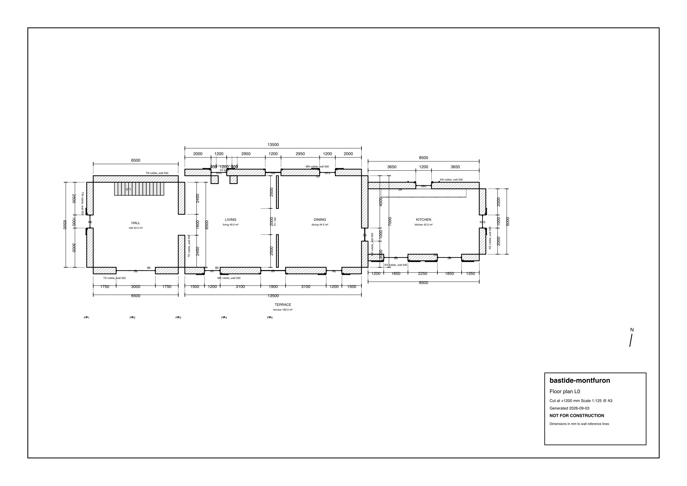 |

The source is [project.py](projects/bastide_montfuron/project.py); the
furniture, planting, sky and camera are in
[presentation.py](projects/bastide_montfuron/presentation.py) and one module
per room under [rooms/](projects/bastide_montfuron/rooms), and never reach the
contractor. Each room was audited and dressed by its own agent from the
brief in [docs/agents/bastide-room-brief.md](docs/agents/bastide-room-brief.md);
`HOMESPEC_ROOM=kitchen` renders one room's views on their own. What the contractor does get is committed under
[deliverables/](projects/bastide_montfuron/deliverables): the IFC, the plans
as PDF and DXF, the schedules, the checks report and the IDS. Published outputs
identify their source build. These selected exports are not a reusable IR bundle;
a standalone IR needs all referenced geometry files. More renders are in
[gallery/](projects/bastide_montfuron/gallery).

```bash
homespec build  projects/bastide_montfuron
homespec render projects/bastide_montfuron --mode still --frame 1,385,1153,1633,2209
homespec render projects/bastide_montfuron --mode save
homespec walk   projects/bastide_montfuron
```

## Build records and data inputs

Build records use `passed`, `failed_checks`, `unchecked`, or `error`. A failed
attempt is recorded without replacing files in an earlier generation, and the
manifest retains `previous_successful_generation` for recovery. `report.json`
contains results, artifact paths and timings; `build.json` records their hashes
and the input fingerprint. `--no-ifc`, `--no-drawings`, `--no-schedules` and
`--no-checks` describe the new generation only.

Python project/package sources, decisions, dependency versions and build options
are fingerprinted automatically. Declare other data reads with
`House("cabin", inputs=["survey.csv", "products/"])`; paths are relative to the
project, and directories include their files. Keep `build()` free of side
effects: projects with declared inputs are evaluated once to discover the inputs,
then again against the captured snapshot. Changes during compilation prevent
successful publication. See [the build API](docs/design.md#build-publication-and-consumers).

## Development

```bash
uv run --frozen pytest                 # unit, property and end-to-end tests
uv run --frozen ruff check homespec    # lint
uv run --frozen pyright                # types
uv run --frozen homespec schema        # IR 0.3 JSON schema
```

## Status

Alpha. Three example projects, up to three storeys, straight walls, gable,
hip, shed and flat roofs, straight stairs, pools. See the end of
`docs/design.md` for what is deliberately not here yet.

MIT licensed.
