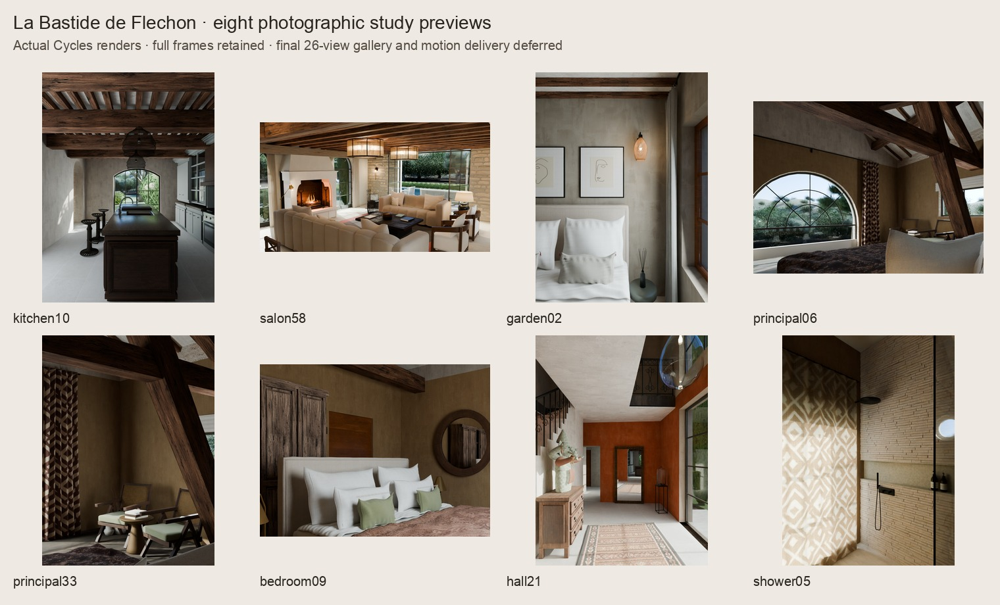

# La Bastide de Fléchon

A detailed, editable HomeSpec reconstruction of the house in `LABASTIDEDEFLECHON.zip`, based on 61 photos, both floor plans, the site plan and the supplied brochures.

The integrated source is ready for review. At the user’s request, the full 26-view render, completed motion video, portable-package refresh and final artifact-verification pass are deferred. The eight study previews below show the reviewed geometry and lighting; they are not a completed delivery set.

After packaging, double-click **Walk Bastide.command** to open the furnished, textured house in Blender. In the **Flechon** sidebar, choose a room and click **Walk from here**.

- Mouse: look around. **W A S D**: move. **Q / E**: down / up.
- **Shift**: move faster. **Tab**: toggle gravity.
- **Click / Enter**: finish moving. **Esc**: cancel. **N**: show room shortcuts.
- **Eevee** is the interactive renderer. Choose **Cycles** in the sidebar for more accurate lighting that refines while you pause.

The 26 bookmarks cover the garden, pool house, living and dining rooms, kitchen, entrance, all five bedrooms, all five bathrooms, laundry, WC and circulation spaces. The model is freely navigable between bookmarks. The Cycles motion renderer produces three short moving-camera takes through the kitchen, principal suite and salon; the bookmarks remain freely selectable.



## Standalone salon review evidence

The salon implementation is integrated in the merged house source. An
independent salon study completed two full-resolution views before the user
deferred further rendering: [fireplace/garden](salon-review-wide.jpg) and
[frontal garden](salon-review-front.jpg). These committed JPEGs are downscales
of the actual PNGs, with [source/camera/render provenance](salon-review-status.json).
Their standalone lighting precedes the combined house calibration; they do
not replace the current integrated study previews above.

[Salon verification](salon-verification.md) records the two completed views,
reviewed controls, twelve deferred final views, unproduced comparison PDF and
unrefreshed portable model. It also records a likely remaining outboard axial
beam-placement error, with photographic projection evidence. Geometry remains
unchanged pending a later correction and render review. [Material provenance](salon-materials-provenance.md)
and the [discrepancy inventory](salon-discrepancies.md) retain the detailed limits.

## Focused kitchen reconstruction

The kitchen study adds a thin stone slab and hollow sink, a supported seating extension, corrected cabinet fronts, three wire pendants, dense fine joists, a flat hall lintel, and quieter room finishes. [Kitchen verification](kitchen-verification.md) records the frozen source, matched before/after previews, geometry and material checks, and remaining photographic differences. The [evidence review](kitchen-discrepancies.md) separates observed construction from inferred dimensions. This focused pass does not refresh the full-house delivery.

## Files

Expected local outputs from the commands below. The full refresh is deferred, so some outputs are absent or belong to earlier diagnostic runs. `review-photo-pass.jpg` is the committed preview sheet; `review-gallery.jpg` retains the prior pass’s gallery.

- `deliverables/La-Bastide-de-Flechon-Walkthrough.zip`: complete portable walkthrough folder; unzip and open its launcher.
- `deliverables/model/house_walk.blend`: portable model with packed textures and sky.
- `deliverables/model/Walk Bastide.command`: portable launcher; keep it beside `walk_ui.py` and the model.
- `deliverables/gallery/`: 26 rendered views of the actual 3D model.
- `deliverables/cycles-tour/bastide-cycles-motion-review.mp4`: actual Cycles camera motion, with every frame rendered from the saved model.
- `deliverables/cycles-tour/tour-manifest.json`: frame cameras, path checks, source hashes and independent video verification.
- `deliverables/gallery-manifest.json`: source generation, render settings and image hashes.
- `deliverables/photo-comparison/`: eight actual model renders from the committed photograph camera lock.
- `deliverables/comparison-baseline/`: the preserved baseline rendered through those same cameras.
- `deliverables/light-controls-off/` and `deliverables/light-controls-on/`: matched kitchen/salon aperture-light controls.
- `deliverables/comparison-assets/`: uncropped web-ready pairs, labeled review sheets and source/render provenance.
- `deliverables/material-studies/`: the actual scene shaders under neutral studio lighting.
- `deliverables/house.ifc`: editable architectural geometry for BIM software.
- `deliverables/drawings/` and `deliverables/schedules/`: floor plans and model schedules.
- `deliverables/SOURCE.json`: generation, material/source fingerprints and exported model hash.
- `deliverables/artifact-verification.json`: final independent delivery checks, written only when verification passes.
- `verification.md`: checks, visual review and remaining reconstruction limits.
- `salon-verification.md`: standalone salon evidence and explicit deferred work.

The source is `project.py`, `presentation.py`, `rooms/`, `textures/` and `floor_layout.json`. Geometry uses millimetres; presentation coordinates use metres. The original photos and full-resolution plan reviews are retained locally in `reference/`.

## Rebuild

Use the locked environment from the repository root:

```sh
uv sync --frozen --extra dev --python 3.13
uv run --frozen homespec assets --manifest projects/bastide_de_flechon/assets.json
uv run --frozen homespec build projects/bastide_de_flechon
uv run --frozen homespec views projects/bastide_de_flechon --only plan,section
uv run --frozen homespec audit projects/bastide_de_flechon
HOMESPEC_RES=960x600 HOMESPEC_SAMPLES=32 \
  uv run --frozen homespec render projects/bastide_de_flechon --mode still --frame 1
```

Build outputs use immutable generations under `out/bastide_de_flechon/generations/`. The presentation directory contains `house.blend`. Resolve the current checked scene after the build and initial render:

```sh
FLECHON_PROJECT=projects/bastide_de_flechon
FLECHON_BLENDER="${HOMESPEC_BLENDER:-/Applications/Blender.app/Contents/MacOS/Blender}"
FLECHON_SCENE="$(uv run --frozen python - <<'PY'
from pathlib import Path
from homespec import buildstate
project = Path('projects/bastide_de_flechon').resolve()
generation = buildstate.resolve_build(project.parents[1] / 'out' / project.name, project, allow_failed_checks=False)
presentation, _ = buildstate.presentation_directory(generation, project)
print(presentation / 'house.blend')
PY
)"
FLECHON_BASELINE_SCENE="$(uv run --frozen python - <<'PY'
import json
from pathlib import Path
source = json.loads(Path('projects/bastide_de_flechon/deliverables/baseline/SOURCE.json').read_text())
print(Path(source['presentation']) / 'house.blend')
PY
)"
```

Run Blender jobs sequentially. The following scripts inspect/render the loaded scene without saving over it. They use the current camera lock and source hashes; changing source requires a new build and presentation.

The baseline command loads the original raw `house.blend` at the presentation path recorded in its `SOURCE.json`. Keep that directory and its relative assets accessible: a moved raw clone can resolve textures differently. The packed baseline remains preserved separately; it is not the scene used for this comparison.

## Reproduce the delivery

The eight comparisons use the v4 camera lock and 32-sample `preview` quality: portraits are 900 × 1200, principal06/bedroom09 are 1200 × 900, and salon58 is 1400 × 788. Baseline lighting stays as saved. Current views use the named photograph studies. These pairs therefore show the combined geometry, material and lighting change; they are not a controlled single-variable lighting test.

```sh
env -u FLECHON_LIGHT_PRESET -u FLECHON_WINDOW_LIGHTS -u FLECHON_CLAY -u FLECHON_CAMERA_LOCK \
  "$FLECHON_BLENDER" -b "$FLECHON_BASELINE_SCENE" \
  --python-exit-code 1 --python "$FLECHON_PROJECT/photo_camera_review.py" -- \
  "$FLECHON_PROJECT/deliverables/comparison-baseline" preview

env -u FLECHON_WINDOW_LIGHTS -u FLECHON_CLAY -u FLECHON_CAMERA_LOCK FLECHON_LIGHT_PRESET=photo \
  "$FLECHON_BLENDER" -b "$FLECHON_SCENE" \
  --python-exit-code 1 --python "$FLECHON_PROJECT/photo_camera_review.py" -- \
  "$FLECHON_PROJECT/deliverables/photo-comparison" preview
```

Render the required kitchen10/salon58 light controls with identical current scene, camera lock, preview settings and named photo preset. Only the aperture contribution changes from off to full power; the regular comparison above uses each preset's configured reduced fraction.

```sh
env -u FLECHON_CLAY -u FLECHON_CAMERA_LOCK FLECHON_LIGHT_PRESET=photo FLECHON_WINDOW_LIGHTS=0 \
  "$FLECHON_BLENDER" -b "$FLECHON_SCENE" \
  --python-exit-code 1 --python "$FLECHON_PROJECT/photo_camera_review.py" -- \
  "$FLECHON_PROJECT/deliverables/light-controls-off" preview kitchen10,salon58

env -u FLECHON_CLAY -u FLECHON_CAMERA_LOCK FLECHON_LIGHT_PRESET=photo FLECHON_WINDOW_LIGHTS=1 \
  "$FLECHON_BLENDER" -b "$FLECHON_SCENE" \
  --python-exit-code 1 --python "$FLECHON_PROJECT/photo_camera_review.py" -- \
  "$FLECHON_PROJECT/deliverables/light-controls-on" preview kitchen10,salon58
```

Render the actual scene materials in the neutral studio, then all 26 bookmarks at 1600 × 1000 with up to 64 Cycles samples. The studio manifest records its current swatch layout and settings.

```sh
"$FLECHON_BLENDER" -b "$FLECHON_SCENE" \
  --python-exit-code 1 --python "$FLECHON_PROJECT/material_studies.py" -- \
  "$FLECHON_PROJECT/deliverables/material-studies"

"$FLECHON_BLENDER" -b "$FLECHON_SCENE" \
  --python-exit-code 1 --python "$FLECHON_PROJECT/verify_views.py" -- \
  "$FLECHON_PROJECT/deliverables" final
```

The motion review is nine seconds: 216 actual rendered frames at 24 fps, three takes with 0.20 m camera travel each, 640 × 400, 16 samples and adaptive threshold 0.12. This is a motion-review resolution. Every frame and swept path segment is checked; ffmpeg encodes the MP4 and independently decodes it. PNGs are removed only after the video and three contact strips pass. A mismatched existing tour manifest is rejected; use a fresh output directory when inputs change.

```sh
FLECHON_TOUR_SECONDS=9 FLECHON_TOUR_FPS=24 FLECHON_TOUR_SIZE=640x400 \
FLECHON_TOUR_SAMPLES=16 FLECHON_TOUR_ADAPTIVE=0.12 FLECHON_TOUR_TRAVEL=0.20 \
  "$FLECHON_BLENDER" -b "$FLECHON_SCENE" \
  --python-exit-code 1 --python "$FLECHON_PROJECT/render_camera_tour.py" -- \
  "$FLECHON_PROJECT/deliverables/cycles-tour"
```

Package the portable model, create uncropped comparison assets/overviews and the ZIP, then run independent delivery verification. `package_model.py` also launches Blender and should run with the same exclusive render slot.

```sh
uv run --frozen python "$FLECHON_PROJECT/package_model.py"
uv run --frozen --with pillow python "$FLECHON_PROJECT/review_assets.py" \
  --baseline-manifest "$FLECHON_PROJECT/deliverables/comparison-baseline/camera-review-manifest.json" --zip
uv run --frozen python "$FLECHON_PROJECT/verify_delivery.py"
```

`--with pillow` supplies the review tool's image dependency for that command without changing project dependencies. These commands are the reproduction procedure for the deferred artifact pass. `verification.md` distinguishes completed source/study checks from the unfinished final delivery.

For the current salon comparison suite, pass the freshly built `house.blend`
path to Blender:

```sh
blender -b /absolute/path/to/house.blend --python-exit-code 1 \
  --python projects/bastide_de_flechon/salon_review.py -- \
  projects/bastide_de_flechon/deliverables/salon-review/final final \
  salon58,photo26,photo57,fireplace58,floor13,trim31 --mode beauty --preset walk
```

Use `--preset reference58`, `apertures-off` or `apertures-reflective` for the
separate lighting comparisons, and `--mode neutral` or `clay` for inspection.
Final output is 3840 pixels wide, with each view's stated aspect ratio, up to
256 Cycles samples and 16-bit PNG output. Every manifest records the exact
source images, camera, lighting, render and saved-scene hashes. Review modes
restore the loaded scene and never overwrite the saved model.

## Fidelity

The model follows the irregular footprint and room connections in the plans. The third photographic pass corrects the kitchen's segmental garden-door head and four heavy beams, restores the north-wall orientation of both garden beds, and distinguishes the shared front glazing width from its wider stone surround. Furniture remains editable: the kitchen has a real sink opening, bedrooms have recessed wardrobe shelves and softer bedding, and wood surfaces use grain aligned to their parts.

The salon reconstruction from `ac42812` adds four integrated modules: `salon_envelope`, `salon_fireplace`, `salon_furniture` and `salon_materials`. They supply individual stone floors/walls and opening details, a modeled hearth/fireback/ironwork, softer seating and carved furniture, and distinct finishes. Their source integration does not establish final photographic acceptance; `salon-discrepancies.md` keeps the detailed limits.

The committed `photo_camera_lock.json` records original JPEG lens metadata, camera estimates, lens shifts and visible landmarks. Both baseline and current comparisons use that same lock. V4 salon58 uses position `(0.65, 8.8, 2.08)` m, target `(5.1, 3.0, 1.36)` m, native 30 mm lens and zero shifts: the higher eye and slight downward aim retain the seating, table and fireplace with the dining geometry present. Its pose remains inferred. Camera residuals expose geometry/framing disagreement; they are not a likeness score. `camera_calibration.md` documents the fitting method and `photo-discrepancies.md` records remaining differences room by room, including principal bed/brace framing and the cropped upper-bedroom bed foot.

Pigment maps are distinct from inferred physical roughness and small surface relief. The neutral studio uses the actual assigned shaders and checks that generated color maps do not drive roughness or normals. Texture prompts and provenance remain in `textures/generated-manifest.json`, with the salon maps recorded separately.

The coherent walk uses 20% of the preserved full-power aperture lights, selected after off/full/reduced-power Cycles studies. Named photograph presets currently use 20%, except salon58 at 15%. These are documented diffuse-light approximations at real openings, not measured sky radiance. `apply_preset(..., supplemental_windows=None)` uses the configured fraction; explicit `False`/`True` or comparison environment values `0`/`1` select off/full for controlled studies. Effective fractions and actual/base light energies are recorded. The walk keeps one daylight state with room exposure adaptation; photograph presets have separate lighting, exposure and white balance. Exact optical values, solar directions and photographic processing remain inferred.

This is a photo-led reconstruction. Heights, concealed construction, exact furniture dimensions and landscape contours are inferred where the source material does not measure them. It is not a photogrammetric or laser scan. `decisions.md` records these choices.
