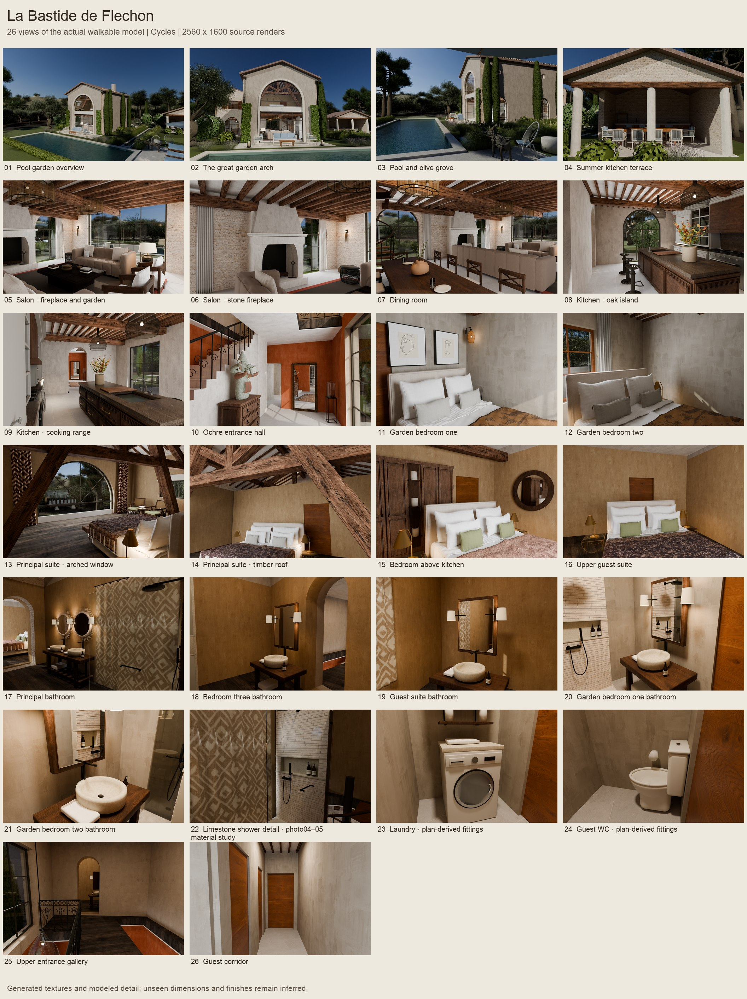

# La Bastide de Fléchon

A detailed, editable HomeSpec reconstruction of the house in `LABASTIDEDEFLECHON.zip`, based on 61 photos, both floor plans, the site plan and the supplied brochures.

Double-click **Walk Bastide.command** to open the furnished, textured house in Blender. In the **Flechon** sidebar, choose a room and click **Walk from here**.

- Mouse: look around. **W A S D**: move. **Q / E**: down / up.
- **Shift**: move faster. **Tab**: toggle gravity.
- **Click / Enter**: finish moving. **Esc**: cancel. **N**: show room shortcuts.
- **Eevee** is the interactive renderer. Choose **Cycles** in the sidebar for more accurate lighting that refines while you pause.

The 26 bookmarks cover the garden, pool house, living and dining rooms, kitchen, entrance, all five bedrooms, all five bathrooms, laundry, WC and circulation spaces. The model is freely navigable between bookmarks. These are camera shortcuts, not an animated video.



## Files

- `deliverables/La-Bastide-de-Flechon-Walkthrough.zip`: complete portable walkthrough folder; unzip and open its launcher.
- `deliverables/model/house_walk.blend`: portable model with packed textures and sky.
- `deliverables/model/Walk Bastide.command`: portable launcher; keep it beside `walk_ui.py` and the model.
- `deliverables/gallery/`: rendered views of the actual 3D model.
- `deliverables/gallery-manifest.json`: source generation, render settings and image hashes.
- `deliverables/photo-comparison/`: eight actual model renders with photograph-comparison framing and provenance.
- `deliverables/house.ifc`: editable architectural geometry for BIM software.
- `deliverables/drawings/` and `deliverables/schedules/`: floor plans and model schedules.
- `deliverables/SOURCE.json`: generation, material/source fingerprints and exported model hash.
- `verification.md`: checks, visual review and remaining reconstruction limits.

The source is `project.py`, `presentation.py`, `rooms/`, `textures/` and `floor_layout.json`. Geometry uses millimetres; presentation coordinates use metres. The original photos and full-resolution plan reviews are retained locally in `reference/`.

## Rebuild

Use the locked environment from the repository root:

```sh
uv sync --frozen --extra dev --python 3.13
uv run --frozen homespec assets --manifest projects/bastide_de_flechon/assets.json
uv run --frozen homespec build projects/bastide_de_flechon
uv run --frozen homespec views projects/bastide_de_flechon --only plan,section
uv run --frozen homespec audit projects/bastide_de_flechon
uv run --frozen homespec render projects/bastide_de_flechon --mode still --frame 1
uv run --frozen python projects/bastide_de_flechon/package_model.py
```

Build outputs use immutable generations under `out/bastide_de_flechon/generations/`. The presentation directory printed by HomeSpec contains `house.blend`; `verify_views.py` can render all or selected bookmarks from this saved scene. `HOMESPEC_RES=960x600 HOMESPEC_SAMPLES=32` gives quick iterations. Final gallery settings are 2560 × 1600 with up to 256 Cycles samples. `photo_camera_review.py` provides eight additional photo-comparison compositions without modifying the saved model.

## Fidelity

The model follows the irregular footprint and room connections in the plans, and the photographed arches, fanlight, fireplace, roof structure, joinery, furniture and landscaping. The second pass adds sewn and draped cloth, perforated cane, quilted sofas, detailed cabinetry, complete angled guest timbers, bathroom fittings and service-room furnishings. Nineteen custom image-generated textures cover the room-specific fabrics, limewash, limestone, wood and bronze travertine. Their prompts and provenance are in `textures/generated-manifest.json`.

Still renders and the walkthrough share one coherent south-east daylight state, with sky illumination entering the real openings and warm lamps inside their modeled shades. Surface roughness, grain direction, small relief and curtain transmission are modeled separately. The reference photographs show different daylight states, so a single walkable scene cannot reproduce every photograph's illumination simultaneously.

This is a photo-led reconstruction. Heights, concealed construction, exact furniture dimensions and landscape contours are inferred where the source material does not measure them. It is not a photogrammetric or laser scan. `decisions.md` records these choices.
