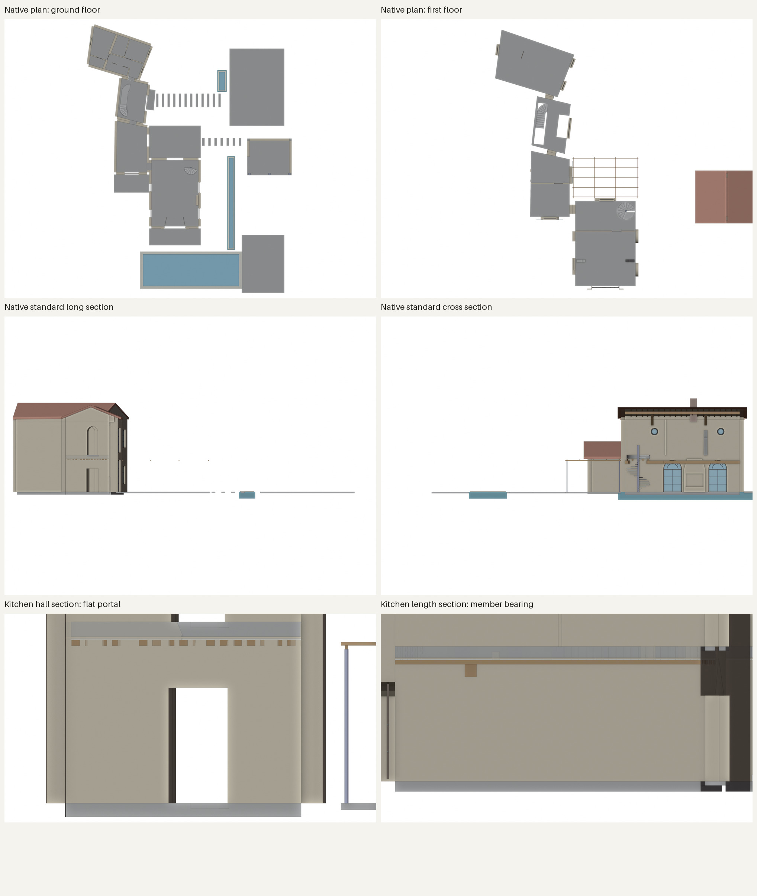
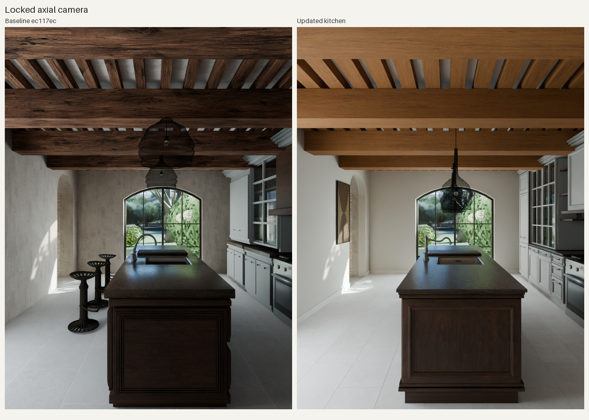
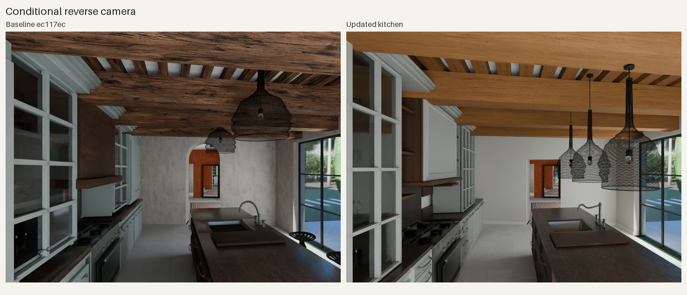
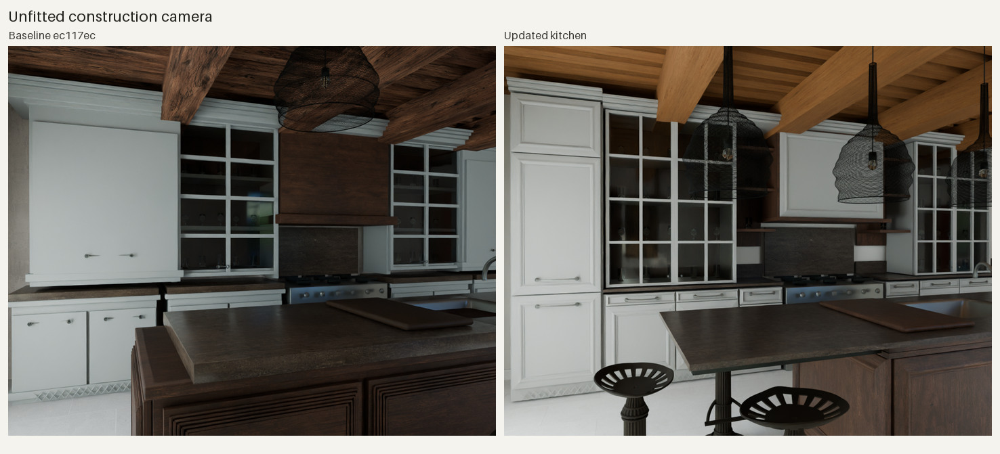
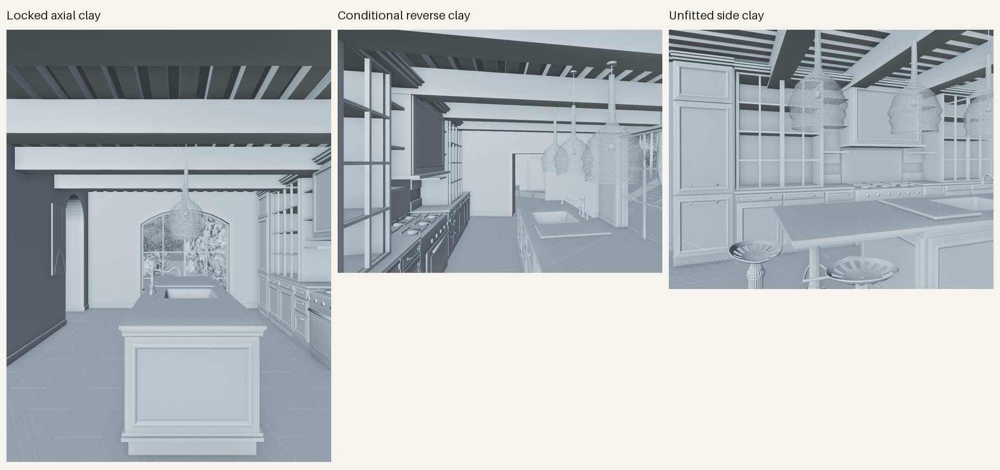
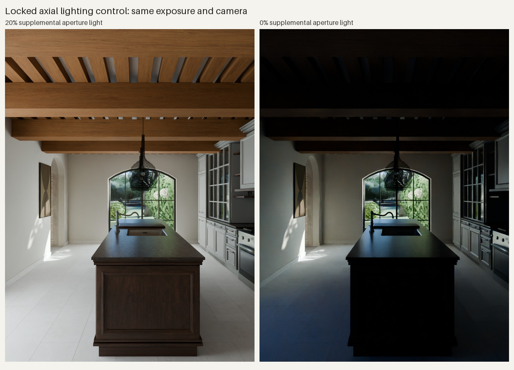
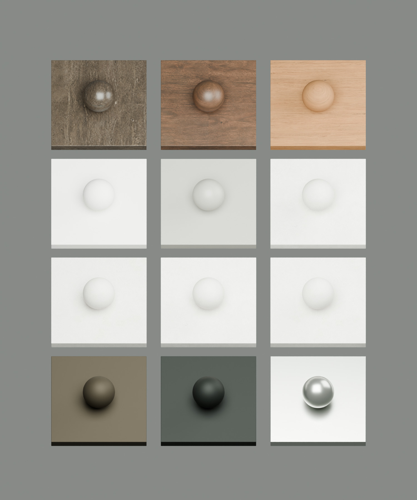

# Focused kitchen verification — 2026-09-05

This is a reviewable kitchen reconstruction, with source fixes and targeted renders. It does not establish exact photographic equivalence. The full-house gallery, motion video and portable-package refresh remain deferred.

## Source and artifacts

The fresh baseline was compiled and saved from merged commit `ec117ec97c3a5610c9f9bf8b8e4fb18b2a2fc5a8`, with 366 passing build checks and zero scene-audit findings. Its unchanged scene bytes, generation and original archive hash are recorded in [kitchen-baseline.json](kitchen-baseline.json).

The final source generation is `bd73002f07a44a1f8904b1c9b32dc116`, presentation fingerprint `1ecb3ca4ed29de4892a97afdc0d58bfe3324e1182310839ab664881ab898415d`. [Review provenance](kitchen-review/verification.json) records actual scene/build/image hashes and paths. The saved Blender file is editable; original photos and ZIP remain unchanged. No user Blender session was modified. Background Blender jobs used one shared exclusive slot.

Changes are confined to the kitchen modules and their integration, two kitchen/hall opening declarations, fine kitchen joist width, focused camera/material evidence, and regression checks. [D-042](decisions.md#d-042-reconstruct-the-kitchens-photographed-construction) records the structural reasons; [the evidence ledger](kitchen-discrepancies.md) distinguishes observed construction from inferred dimensions.

## Mechanical verification

| Check | Result |
| --- | --- |
| Fresh full project build, including IFC/drawings/schedules | 367 passed, zero failed; 54 documented construction clashes |
| Non-Blender test suite | 208 passed, zero skipped |
| Blender 5.2.1 integrations, required executable | 5 passed, zero skipped |
| Ruff / Pyright / whitespace | Passed / zero errors / passed |
| Final saved-scene audit | Zero findings; 15,010 objects |
| Independent fresh CLI scene audit | Zero findings |
| Focused evaluated scene checks | 94 passed, zero failed |
| Plan/section diagnostic views | All six rendered and visually inspected |

The [saved-scene checker](kitchen_scene_checks.py) measures the evaluated 25 mm closed stone solid, real cutout, recessed 1.2 mm bowl, unobstructed seating volume, modeled supports and three stool rims bearing on the 2 mm finish. It follows actual shader links, including groups, to reject pigment images upstream of Roughness or Normal. It checks all published fine joists and the four heavy beams, retained end-grain slots, render-active member UVs, and the exposed vertical-grain island fields. It verifies source hashes against the supplied passing build and proves it did not modify the scene bytes. These checks do not assess photographic likeness.

Three initial skirting audit findings came from wide world-axis bounds on thin strips following skew walls. Assigning each strip an aligned local frame preserved every world vertex to floating-point tolerance and produced correct 20 mm bounds, with no audit or tagging change.

The first color preview exposed two further defects despite the initial 45 passing checks: opaque cabinet backing sat 7.5 mm ahead of recessed fields, and an invented `C0_K.beam` name prefix silently excluded the actual `C0_K.B1`…`B20` joists. Backing skins moved inward 28 mm, preserving finished faces and sink clearance; material assignment now takes joist IDs from the published IR. The expanded checker uses scene rays to test the visible fields and checks every joist, so neither omission can silently pass again. Explicit render-active UV layers keep the authored grain mapping in use.

A future generic presentation audit could use similar cavity rays and finished-face visibility probes. Bounds and contact alone cannot establish that a sink is hollow or that a correctly modeled panel is visible. This PR keeps those building-specific checks local.



The native plans preserve the skew footprint and room connections. The focused hall section shows the rectangular floor-reaching opening, square upper corners and flat head, with no spanning masonry lip. Joist ends meet the ceiling band without an apparent gap. The long kitchen section exposes only one heavy beam clearly because the clipped wall obscures the others; counts and bearing are established by the native geometry and saved-scene checks. The standard sections mostly show main-block/exterior context. These six native IR views exclude presentation joinery and are structural diagnostics. Low-contrast plan faces are supplemented by the compiled SVG plan inspection.

## Matched previews

Both scenes use [the same focused camera lock](kitchen_camera_lock.json), unchanged 24 mm photo10 pose and top landmarks, and the same `kitchen10` lighting state: 20% aperture approximation, unlit pendants, identical exposure/white balance. The 32-sample Cycles previews are full uncropped frames. Sheets only resize and label them; they have no color adjustment or retouching. Exact settings and immutable scene/image hashes are in the committed render manifests.



The axial view shows the thinner stone edge and separate wood profile, exposed vertical-grain end panel, stools hidden within the southern seating zone, lower overlapping shades, denser ceiling rhythm and restored wall artwork. The wall finish is quieter. The photo10 pose and island top outline are unchanged.



The reverse view confirms the flat hall lintel, open recessed bowl, revised tap, room-facing cabinet details and three separate pendant bodies. The camera remains conditional; the warmer photographed daylight and exact cabinet proportions have not been recovered.



The side view exposes the seating extension and steel rail beneath the thin stone, with stools facing it. The narrower stacked tower and cabinet profiles are visible. The camera crops the lower stool bases, so physical bearing is established by evaluated rim-to-floor probes rather than this color image alone.

The photo10 residual remains 6.90 pixels at 900×1200. The independent reverse photo00 fit is 10.34 pixels at 1200×900 using five coplanar points, with its y-position at the 9.1 m lower bound. Those are conditional camera/geometry residuals. The separate 28 mm side view is deliberately unfitted and is not presented as photo35's recorded 50 mm capture field.

## Material and lighting controls



The grey geometry views expose the separate thin stone and wood profiles, recessed bowl, under-table rails and flat hall opening. They also show Workbench triangulation/depth artifacts. Their cropped stool feet do not establish floor contact; the 24 evaluated rim probes do.



Removing the supplemental aperture light at the same exposure makes the near island, ceiling and lower cabinets substantially darker. The retained 20% setting improves interior readability, but is an inferred approximation rather than a measured daylight solution. The photographed warmth and highlight range remain unresolved.



The studio uses the twelve actual assigned shaders under a neutral 6500 K softbox and grazing strip at zero exposure compensation. Read left to right, top to bottom: worktop, island walnut, cleaned oak; ceiling lime, painted cabinetry, limestone flag 0; limestone flags 1, 2 and 3; cast stool, blackened wire, sink/tap steel. The board distinguishes the warm walnut and paler oak, the dark cast/wire finishes and reflective steel. It also exposes strong worktop highlights and very pale, subtly varied limestone: these material values are provisional, not measured samples. The spatially masked room-wall shader is not represented by the ceiling-lime sample. The [material manifest](kitchen-review/material-study-manifest.json) records settings, shader checks and sample identities.

Pigment, physical relief and finish are separated in the actual material graphs. The new oak asset, exact built-in generation prompt, image hash, tint and mapping are documented in [surface provenance](kitchen-materials-provenance.md). The first preview was too pale; the final tint was selected under unchanged lighting. Roughness/pore values remain inferred. The coherent whole-house walk preset is unchanged.

## Remaining differences and scope

- The second visible heavy beam is still too tall in the photo10 silhouette. Uniform heavy sections, exact beam axes, ceiling/camera height and corrected image crop remain coupled; this pass retains the four heavy members and their structural bearing.
- The reconstruction does not reproduce the original warm sun patch, processed highlight range or garden background. The fixed lighting controls expose these differences instead of interpreting a low camera residual as overall fidelity.
- Exact cabinet mouldings, handles/appliance detail, stone reflectance and floor wear remain approximate. The wire shades are still too regular and transparent, stool slot/patina detail is simplified, and cleaned timbers are straighter and more uniform than the originals. Pendant count is better established than its dimensions: the nearest inferred shade projects about 184.5 source pixels wide versus the manual 140–165 px estimate.
- The artwork retains a roughly 20–30 source-pixel lateral discrepancy so it remains clear of the dining opening. Its geometric abstraction is not a recovered artwork scan.
- The original plan’s 28 m² kitchen label and the model’s 35.3 m² inside floor area remain unreconciled (area conventions and tracing may differ); this pass preserves the existing footprint. The reverse camera is underconstrained, and the side view is diagnostic. Island dimensions, the 900 mm table extension, concealed steel rails, stool spacing and the 400×800 mm flag module are plausible reconstructions, not surveyed dimensions.
- The parallel exterior and bedroom changes are not included in this branch. In particular, revised terrace openings/roof geometry require a combined kitchen/exterior review after integration. Full-house delivery and final photographic acceptance remain deferred.

## Reproduce the focused checks

Use the locked development environment and the shared exclusive Blender slot described in the project README. Rebuild after a Python/decisions/input change, then resolve the verified generation and presentation directory; do not reuse a stale path.

```bash
uv run --frozen homespec build projects/bastide_de_flechon
uv run --frozen homespec views projects/bastide_de_flechon --only plan,section --focus C0_K,K2,H4
uv run --frozen homespec audit projects/bastide_de_flechon
uv run --frozen homespec render projects/bastide_de_flechon --mode save
uv run --frozen pytest
uv run --frozen ruff check .
uv run --frozen pyright
```

Run `kitchen_scene_checks.py` inside Blender with `--out` and the exact generation's `--build-record`. Run `photo_camera_review.py` against that saved scene with `FLECHON_CAMERA_LOCK` pointing to `kitchen_camera_lock.json`, `FLECHON_LIGHT_PRESET=kitchen10`, quality `preview` and view list `kitchen10,kitchen00,kitchen_side`. Use `FLECHON_CLAY=1` for the geometry control, or `FLECHON_WINDOW_LIGHTS=0` for the daylight control. These controls operate in memory and do not save over the model.

Run `kitchen_material_study.py` inside Blender loaded from the same verified scene, passing its output directory after `--`, for the neutral material board. [Sheet provenance](kitchen-review/sheet-provenance.json) records every original render hash and the full-frame resizing/encoding operations used for this report. Render manifests deduplicate repeated lighting records losslessly: each view's `lighting_study_index` resolves into the root `lighting_studies` list, and the original manifest hash is retained.
