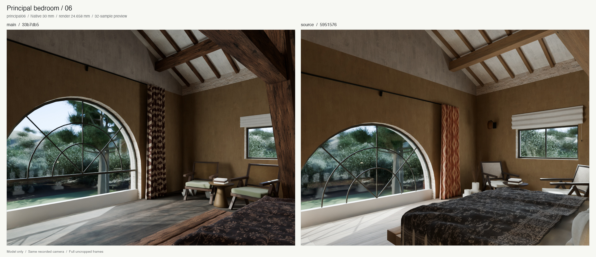
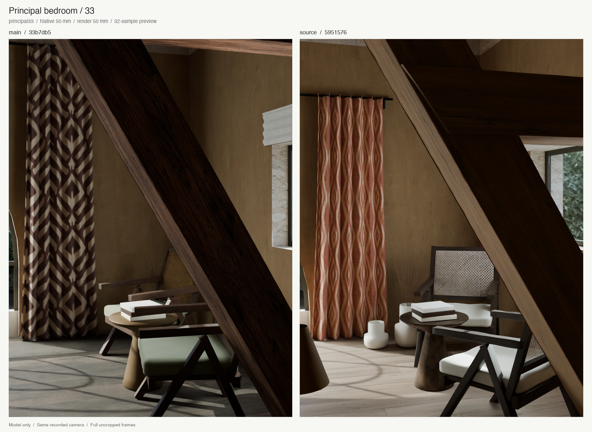

# Principal-suite focused review

<!-- current-image-delivery -->
**Current combined release, 6 September 2026:** [54 final stills and the verified portable model](final-delivery.md) are complete; image-only delivery checks passed 3,408 assertions and the independent local audit passed 966. Video is omitted at the user's request. The release record tracks publication status. The source-specific study below is preserved as historical evidence; its older counts and isolated-study omissions retain their original scope.

The principal suite above the salon now follows the original upper-plan bed,
bench, west-window and front-truss positions. The shared upper fanlight has a
lower spring aligned with the frieze; the lower salon doors, frieze and bathroom
timber continuation are preserved. Individual floorboards, gathered rust ikat,
folded blind, amber sconce, loose bed linen, split-plank bench and cane-chair
joinery replace the earlier approximations. Photo33 supplies the movable
seating, vessels and patinated trumpet table.

This is a reviewed improvement with explicit residuals, not photographic
acceptance. The inventory was written before edits. Source photographs and
plans were inspected from their originals and remain outside the commit.

## Before and after

Both columns use the same frozen camera, native focal prior, exposure and named
photo preset. Left is task baseline main `33b7db5`; right is rendered source
`5951576`. The 32-sample previews retain their full 1200×900 / 900×1200 frames.
The sheets add labels and JPEG encoding only: no cropping, scaling or tone edits.

[Workbench geometry comparison](principal-review-clay.jpg) separates geometry
from appearance. The [figure manifest](principal-review-figures.json) records
input image, scene, camera and script hashes.

The [material studio](principal-review-evidence/neutral-materials.png) uses twelve
actual assigned shaders under one neutral studio. Its
[manifest](principal-review-evidence/material-study-manifest.json) gives the
left-to-right row labels and physical sample sizes. The two
[06](principal-review-evidence/principal06-apertures-off.png) /
[33](principal-review-evidence/principal33-apertures-off.png) aperture-off controls
use the same camera poses at draft size and 12 samples. They expose the dark
interior response without the supplemental opening lights; they are not
pixelwise differences against the larger color previews. Shared walk/photograph
light policy is unchanged. Only the upper aperture rectangle follows the
corrected semicircle, preserving its approximate power per emitting area.

## Verified model

Rendered source `5951576`, native generation
`2499ff23bd534ceca7b46035611042fb`, saved model SHA-256
`909696ed2df9b45065a78e4e2dbfa5c82b3e4a4a1e45cf33c5e6d0ca7de8cba2`.

- Native build: **367 checks passed, 0 failed**, with 54 expected construction
  clashes accepted by the existing rules. Explicit dressed audit: **0 findings**.
- Tests: **204 native and 5 actual Blender tests passed**. Ruff and pyright passed.
- Both 900×500×2000 mm standing prisms beside the bed are clear in native CAD
  and evaluated dressed geometry. This is a local check, not whole-house route
  certification.
- Bed/cloth and bench bounds are separated. All eight chair feet meet the
  measured 3.303 m board datum. The 120 individual boards have no bounds overlap
  or metric-UV errors.
- Chair/curtain and vessel/curtain bounds are separated. Of 80 chair/vessel
  pairs, 75 have separate bounds and five have overlapping bounds but no
  triangle contact. Conservative sampled surface-distance bounds for those
  five are positive, with the smallest **36.1 mm**. This certifies evaluated
  surface separation; it does not test solid containment.
- All 25 curtain hardware objects translate rigidly down 550 mm. The cloth
  height and UV metadata agree. Pigment maps do not feed roughness or normals;
  wood has finite member UVs and separate end-grain assignments.
- 13,499 nonprincipal objects retain their assigned shader fingerprints.
  Native CAD comparisons preserve the entire frieze, lower salon glazing/frame
  and wall regions, bathroom timber continuation, and incidental ceiling
  tessellation changes. All 11 checked symmetric differences are zero.

[Review status and hashes](principal-review-status.json),
[saved-scene measurements](principal-scene-check.json),
[architecture scope](principal-architecture-check.json),
[native standing checks](principal-standing-check.json) and
[all native checks](principal-review-evidence/native-checks.json) retain the
measurement details and limits. Native diagnostic images were rendered and
inspected: [ground plan](principal-review-evidence/11_plan_L0.png),
[upper plan](principal-review-evidence/12_plan_L1.png),
[long section](principal-review-evidence/13_section_long.png) and
[cross section](principal-review-evidence/14_section_cross.png).

## Integration with the merged kitchen pass

Main advanced to kitchen commit `594c83f` during this review. Merge source
`f941d05` preserves both D-042 and D-043 and leaves the seven principal/shared
implementation and camera files, plus the walk/principal lighting presets,
unchanged. Its native generation `d7e4aef7bbc14ff290e3bb22a0843ab8` passes
**368 checks and 208 native tests**. All 19 native CAD comparisons against the
rendered source are zero, including the principal entities and upper kitchen
wall regions; both standing spaces remain clear. The
[integration geometry record](principal-integration-geometry.json) retains these
proofs. The paired images retain their original5951576 provenance; they are not
fresh renders of the combined scene and do not claim identical global lighting.

The combined dressed audit reports **0 findings**, all **5 actual Blender tests
pass** (213 tests total with the native suite), and Ruff/pyright pass. The
[review status](principal-review-status.json) records the separate integration
results and log hashes.

## Remaining photo differences

- The pale upper gable and exposed rubble band above the tobacco finish remain
  conspicuous in06. Their separate envelope finish assignment needs a later
  semantic face-finish correction.
- The06 camera crops the arch/left drape and most of the bench. The window and
  seating framing still differs. Its architectural RMS is 84.34 px at1200×900;
  it is a practical comparison pose, not a recovered camera.
- In33 the broad brace masks the near-chair back, the side tie sits higher in
  the frame and the far-chair back remains high. A cropped bedside-lamp fragment
  enters at lower left. No complete landmark RMS is claimed. A stricter
  numerical fit was rejected when it harmed actual model visibility.
- The floor, cane and seat linen remain paler than the source. Timber checks,
  joinery weathering, curtain rhythm, ceramic profiles and cloth folds are
  inferred editable approximations.
- Photos06/55 have a cylindrical scalloped table and different staging from33.
  The east brace termination, side-tie height and concealed joints remain
  uncertain. No structural member was hidden or shortened for a camera.

[Camera evidence](principal-camera-evidence.md),
[trial ledger](principal-camera-trials.json),
[final camera assessment](principal-camera-assessment.json),
[discrepancies](principal-discrepancies.md) and
[material provenance](principal-material-provenance.json) explain the sources,
rejected trials and remaining uncertainty. The frozen camera lock still carries
its earlier pending status so its hash stays unchanged; final review status is
recorded separately in the linked review-status file.

Full-house gallery, animation, full-resolution image queue and portable model
repack remain deferred. This delivery contains compact model-only evidence and
reproducible source. The branch is intended for review, not automatic merging.
